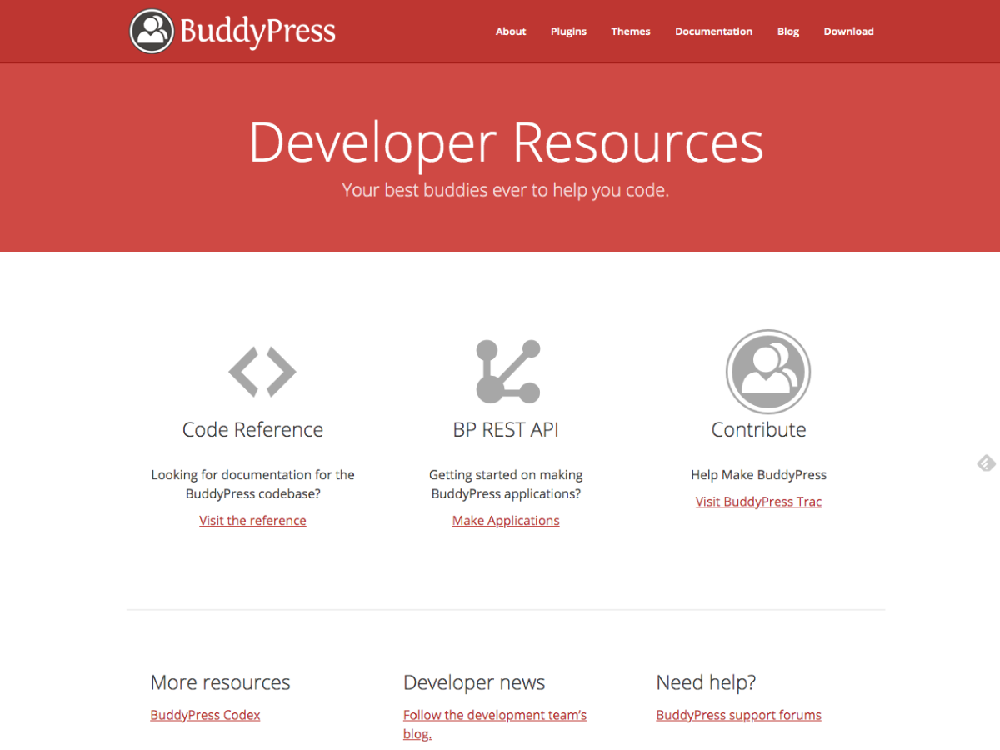

# bporg-developer

A [wporg-developer](https://meta.trac.wordpress.org/browser/sites/trunk/wordpress.org/public_html/wp-content/themes/pub/wporg-developer)'s kid.

## Requirements
- The [wporg-developer](https://meta.trac.wordpress.org/browser/sites/trunk/wordpress.org/public_html/wp-content/themes/pub/wporg-developer) theme.
- The [WordPress Handbook](https://meta.trac.wordpress.org/browser/sites/trunk/wordpress.org/public_html/wp-content/plugins/handbook) plugin.
- The [Syntax Highlighter Evolve](https://wordpress.org/plugins/syntaxhighlighter/) plugin.
- The [WP Parser](https://github.com/WordPress/phpdoc-parser) plugin.

## Optional
- This [fork](https://github.com/imath/Restsplain/releases/tag/1.1.0-bp-rest-api) of the [Restsplain](https://github.com/humanmade/Restsplain) plugin.
